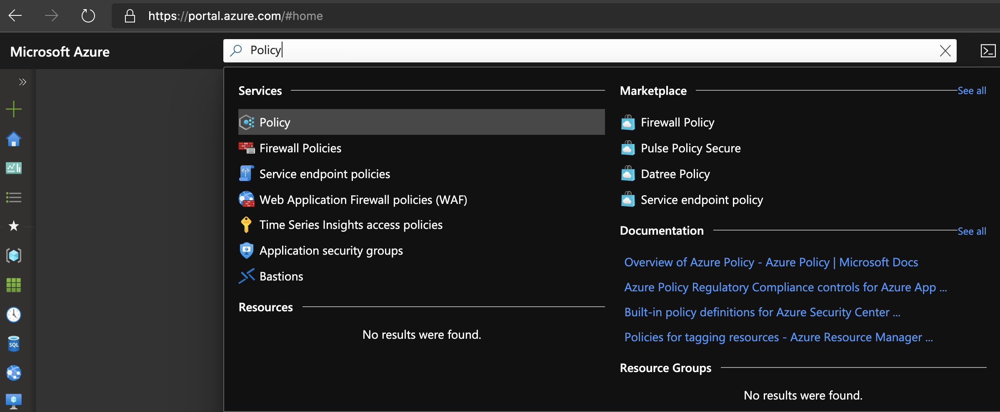
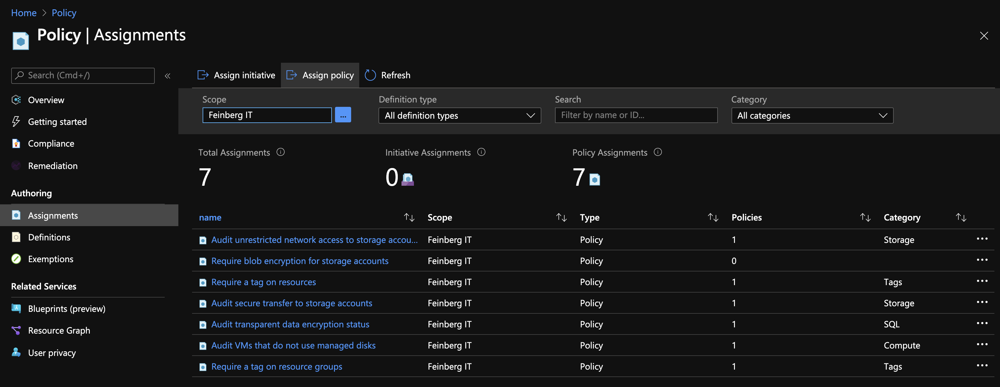
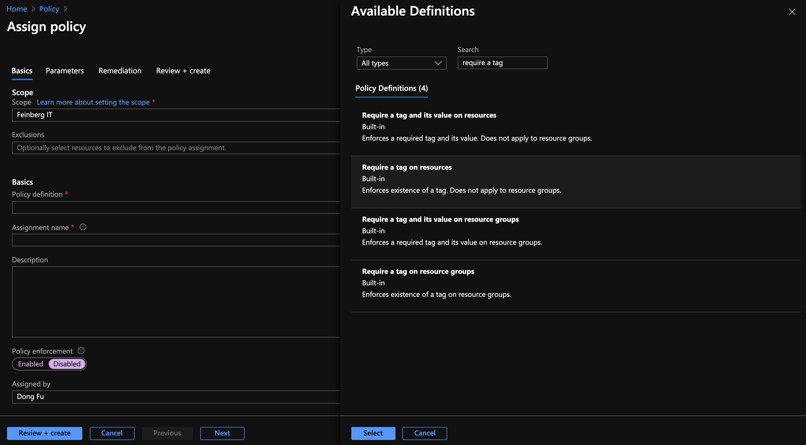
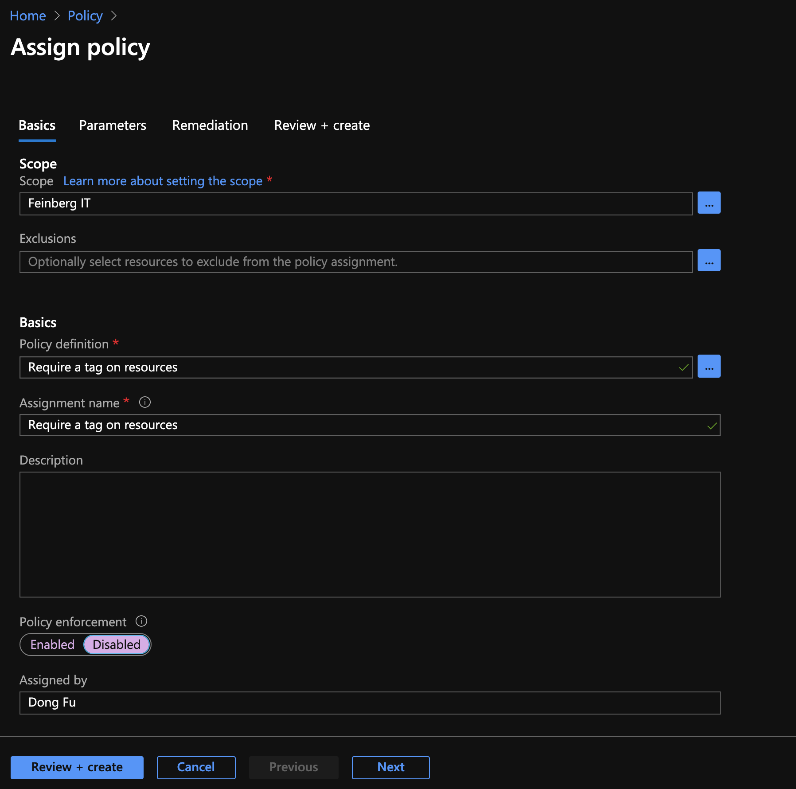
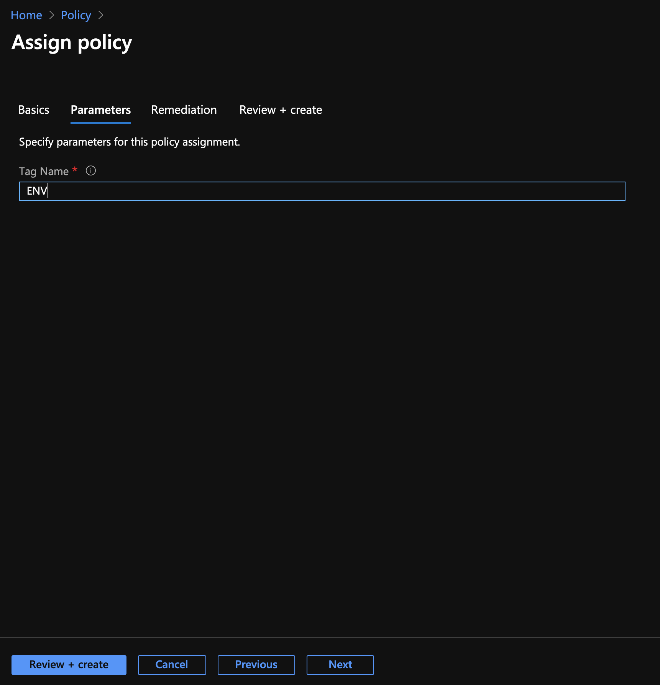
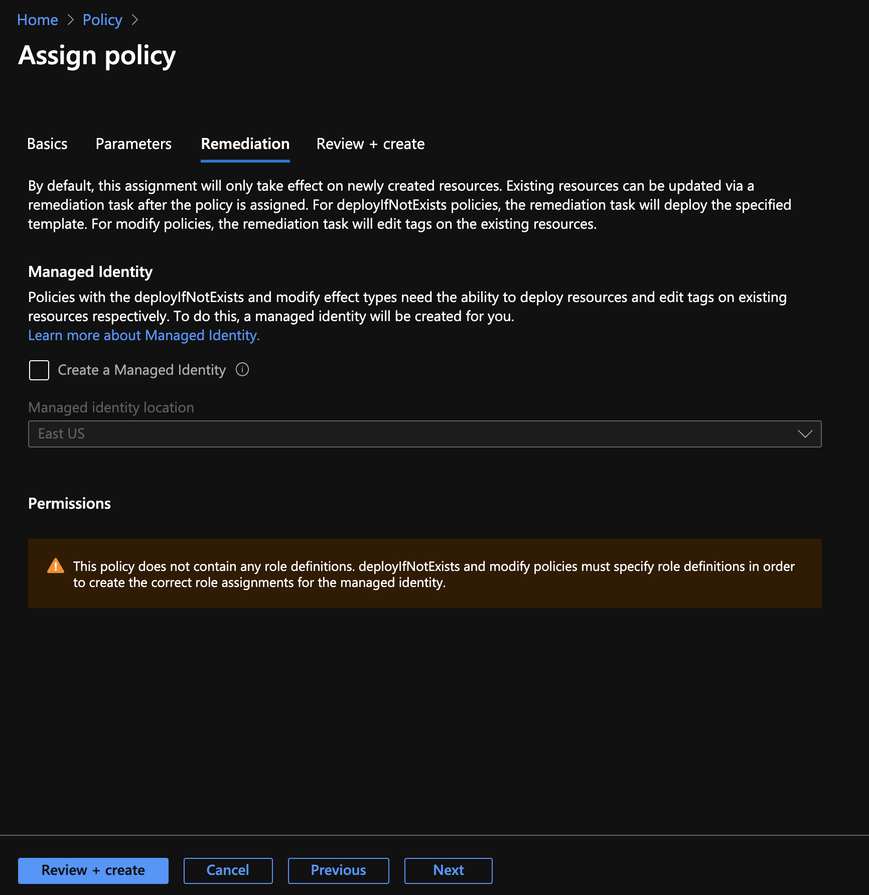

Identifying and Reporting Untagged Resources in Azure using Policy in Azure Portal
=========

[Microsoft Azure Policy](https://azure.microsoft.com/en-us/services/azure-policy) has built-in policies that can be leveraged to report on untagged resources (and resource groups).  

Note:
* The question is slightly changed from "finding any resources or resource groups without tag(s)" to "finding any resources or resource groups that do not have the desired tag(s)", 
which is a better use case. 
* ***Subscription owner role is needed to assign policy***

### Step 1 - Assign policy
* Login to Azure Portal (https://portal.azure.com)
* Search for **Policy**, which will bring you to Azure Policy under Services category.   Click on **Policy** to open its own pane.  

* Click on **Assignments** on the left, and then click on **Assign Policy** in the top middle.
  

* Now you will arrive at the **Policy Assignment** pane, pick the desired scope (Management Group, Subscription)  
  

* Click on ... in **Policy Definition** to open up the Available Definitions pane.   Put **require a tag** in the search box.   Pick **Require a tag on resources**, which will automatically fill the **Assign Policy** pane.   
  

* ***Make sure for Policy Enforcement, Disabled is checked*** (the default is enabled).  Click Next to continue to **Parameters**
  

* In the Tag Name field, type in the desired Tag you want to look for (such as ENV).  Click Next to continue to **Remediation**
  

* You can leave the default settings on the Remediation page.  Click Next to continue to the **Review and Create** page
  

* Click on **Create**

* Repeat the same for the Policy Assignment with "Require a tag on resource groups".  Microsoft somehow treats resource tagging and resource groups tagging differently.   
* You can also narrow down the policy to a particular tag name-value pair.

----
### Wait (between 2 to 12 hours, depending on the scope to check)
----
### Step 2 - Check Compliance

Now the moment of truth.  When you click on the Compliance section of the Azure Policy page, now you would see some interesting findings.  You can also drill down the findings to see what assets are not tagged (with your designed tag)  

### Next Step

Microsoft designed the various Azure policies to be used not only for checking but also enforcing, which could be very powerful.  However, enforcing is on new assets only, while remediation requires extra setup to fix existing assets.  

### References
* [Azure Policy Overview](https://docs.microsoft.com/en-us/azure/governance/policy/overview)
* [List of Built-in Policies](https://docs.microsoft.com/en-us/azure/governance/policy/samples/built-in-policies)
* [Remediation](https://docs.microsoft.com/en-us/azure/governance/policy/how-to/remediate-resources)

